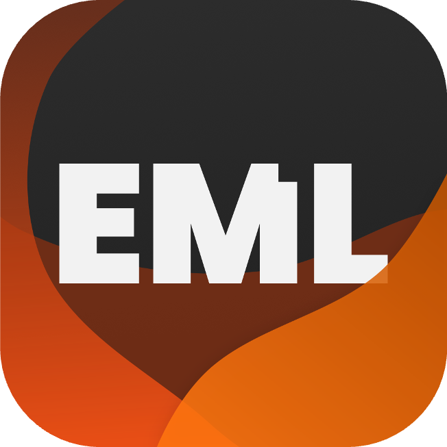

# Dominio Launcher

<p align="center">
  
</p>

<h3 align="center">Lanzador moderno, rápido y multiplataforma para Minecraft</h3>

<p align="center">
  
  
  
  
  
</p>

---

## 📖 Descripción General

**Dominio Launcher** es un lanzador personalizado de Minecraft diseñado para ofrecer la mejor experiencia de juego a la comunidad de **Dominio Craft**. Construido sobre **Electron**, **Vite** y **TypeScript**, combina un arranque ultrarrápido con sincronización de contenido en la nube y soporte nativo para jugadores **Offline (No Premium)** y **Microsoft**.

Powered by <a href="https://github.com/Electron-Minecraft-Launcher/EML-Lib-v2"><b>EML Lib</b></a>.

---

## ✨ Características Principales

- **🔓 Modo Dual de Autenticación**:
  - **Modo Offline (No Premium / Cracked)**: Inicio de sesión instantáneo con validación de nickname, UUID determinístico y skins personalizadas.
  - **Cuentas Microsoft**: Autenticación oficial OAuth y soporte completo para cuentas oficiales.
- **⚡ NeoForge 1.21.1 Autónomo**:
  - Instalación y ejecución automática del juego y el cargador de mods sin requerir software externo ni launchers intermedios.
- **☁️ Sincronización Automática vía CDN**:
  - Descarga y actualización automática de **Mods** (`mods/`), **Shaders** (`shaderpacks/`), **Paquetes de Texturas** (`resourcepacks/`) y **Configuraciones** (`config/`) mediante verificación por hash **SHA-1**.
- **📰 Feed de Noticias en Vivo**:
  - Noticias y eventos sincronizados en tiempo real desde tu CDN a través de un archivo `news.json` con soporte para Markdown, tags de colores e imágenes.
- **🎨 Interfaz Inspirada en Minecraft**:
  - Paleta oficial gris oscuro (`#242424` / `#181818`) y acentos en verde esmeralda (`#2ca845`). Fondo personalizado con efecto glassmorphism y cobertura completa de ventana.
- **☕ Java Automático**:
  - Detección e instalación automática del Java JRE requerido en segundo plano.
- **🛠️ Generador de Manifiestos CLI**:
  - Incluye herramienta para escanear tus mods locales y generar el `modpack.json` para tu CDN en segundos con un solo comando.

---

## 🚀 Inicio Rápido en Desarrollo

### Requisitos Previos
- **Node.js** (v18, v20 o v22 LTS recomendado)
- **npm** (incluido con Node.js)

### Instalación

1. Clona el repositorio:
   ```bash
   git clone https://github.com/Briamco/domaincraft-launcher.git
   cd domaincraft-launcher
   ```

2. Instala las dependencias:
   ```bash
   npm install
   ```

3. Copia el archivo de entorno y configura tu CDN (opcional en desarrollo):
   ```bash
   cp .env.example .env
   ```

4. Inicia la aplicación en modo desarrollo:
   ```bash
   npm run dev
   ```

---

## ⚙️ Configuración del CDN (.env)

Puedes configurar las URLs de tu servidor o CDN directamente en el archivo `.env`:

```env
# URL base de tu CDN (Cloudflare R2, S3, Nginx, etc.)
VITE_CDN_URL=https://cdn.tudominio.com

# URL directa al manifiesto de mods (modpack.json)
VITE_MODPACK_URL=https://cdn.tudominio.com/modpack.json

# URL directa al feed de noticias (news.json)
VITE_NEWS_URL=https://cdn.tudominio.com/news.json
```

> [!TIP]
> Si no defines las variables de modpack o noticias, el launcher asumirá por defecto `${VITE_CDN_URL}/modpack.json` y `${VITE_CDN_URL}/news.json`.

---

## 🛠️ Scripts y Comandos Disponibles

| Comando | Descripción |
| ------- | ----------- |
| `npm run dev` | Inicia el launcher en modo desarrollo con Hot Module Replacement (HMR) |
| `npm run build` | Compila TypeScript y genera los bundles de producción con Vite |
| `npm run generate:modpack` | Escanea una carpeta de mods y genera el archivo `modpack.json` con hashes SHA-1 |
| `npm run release:win` | Empaqueta y genera el instalador ejecutable `.exe` (NSIS) para **Windows** |
| `npm run release:mac` | Empaqueta el instalador `.dmg` para **macOS** |
| `npm run release:lin` | Empaqueta instaladores `.AppImage`, `.deb` y `.rpm` para **Linux** |

---

## 📚 Documentación Detallada

Hemos preparado guías especializadas dentro de la carpeta [docs/](docs/):

- 🌐 [**Guía de CDN y Modpacks**](docs/CDN_Y_MODPACK.md): Cómo alojar tus archivos en Cloudflare R2 o S3, redactar noticias, organizar mods, shaders, texturas y usar el generador automático.
- 🏛️ [**Arquitectura del Sistema**](docs/ARQUITECTURA.md): Explicación técnica del proceso Electron Main, capa Preload, Renderer, autenticación offline y ciclo de vida de ejecución.
- 📦 [**Compilación y Distribución**](docs/COMPILACION_Y_DISTRIBUCION.md): Paso a paso para empaquetar el instalador `.exe` de Windows, personalizar los iconos y distribuir el juego a tus jugadores.

---

## 📄 Licencia y Créditos

Este proyecto está bajo la licencia **MIT**. Consulta el archivo [LICENSE](LICENSE) para más detalles.

- Desarrollado para **Dominio Craft**.
- Motor de lanzamiento impulsado por [EML Lib](https://github.com/Electron-Minecraft-Launcher/EML-Lib-v2).
