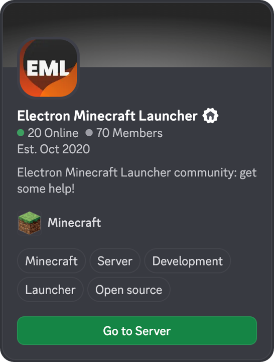

# Dominio Launcher

**Dominio Launcher es un lanzador moderno, rápido y multiplataforma para Minecraft.**

Powered by <a href="https://github.com/Electron-Minecraft-Launcher/EML-Lib-v2"><b>EML Lib</b></a>

[](package.json)</p>

<p>
<center>
<a href="https://emlproject.com/discord/github">
  
</a>
</center>
</p>

---

## Introduction

**EML Template** acts as the frontend foundation for the _Electron Minecraft Launcher_ ecosystem. It is a pre-configured **Electron + Vite** application designed to provide the best possible gaming experience.

It is engineered to work in perfect synergy with **EML Lib** (for the core logic) and **EML AdminTool** (for configuration).

## Features

- **Next-gen performance**: Built on **Vite**, offering instant startup and Hot-Module-Replacement (HMR).
- **Microsoft authentication**: Full integration of the official authentication flow via EML Lib.
- **Asset management**: Smart downloading of game files (Java, libraries, assets, mods) with hash validation, thanks to EML Lib and EML AdminTool (optional).
- **Auto-update**: Automatic update system linked to your EML AdminTool instance.
- **Skin & cape management**: View and equip skins and capes directly from the launcher.

## Installation & Development

### Prerequisites

Before starting, ensure you have installed:

- **Node.js** (v18 or higher recommended)
- **npm** (or Yarn/Pnpm)

### Setup

1.  Clone the repository:

    ```bash
    git clone https://github.com/Electron-Minecraft-Launcher/EML-Template.git
    cd EML-Template
    ```

2.  Install dependencies:

    ```bash
    npm install
    ```

    _Note: This will automatically install `eml-lib` and build tools._

3.  Start in Development mode:

    ```bash
    npm run dev
    ```

    An Electron window will open with hot-reloading enabled.

## Configuration

### Link to your EML AdminTool instance

Modify the configuration file (`electron/const.ts`) to point to your distribution URL generated by **EML AdminTool**.

> [!TIP]
> Since EML Lib v2.2.0, you can use EML Template without an EML AdminTool instance by providing a custom configuration object directly in the code. However, using EML AdminTool is recommended for easier management and updates.

### Icon customization

To change the visual identity, replace the files in the `build/` folder:

- `icon.png`: Standard icon (512x512).
- `icon.ico`: For Windows.
- `icon.icns`: For macOS (Legacy & Liquid Glass fallback).
- `background.png`: DMG Installer background (macOS).

### Build (distribution)

To create the final executables for distribution:

| Platform | Command               | Output format               |
| -------- | --------------------- | --------------------------- |
| Windows  | `npm run release:win` | `.exe` (NSIS Installer)     |
| macOS    | `npm run release:mac` | `.dmg` (Disk Image)         |
| Linux    | `npm run release:lin` | `.AppImage`, `.deb`, `.rpm` |

Compiled files will be located in the `release/` folder.

## Contributing

Contributions are welcome! For major changes, please open an issue first to discuss what you would like to change.

