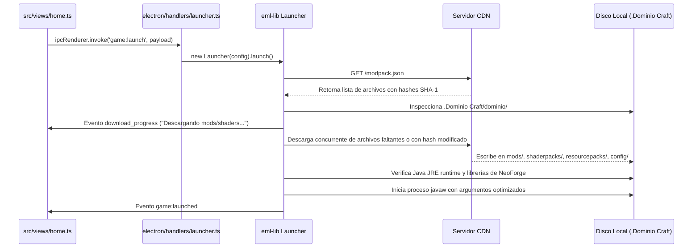

# Arquitectura Técnica de Dominio Launcher

Este documento describe la arquitectura interna, el flujo de datos, la gestión de sesiones y el ciclo de vida de ejecución del juego en **Dominio Launcher**.

---

## 🏛️ Vista General de la Arquitectura

Dominio Launcher está construido sobre una arquitectura **Electron + Vite + TypeScript**, separando estrictamente el proceso principal de Node.js del entorno de renderizado en el navegador:

```mermaid
flowchart TD
    subgraph Electron_Main [Proceso Principal - Node.js / electron/]
        Config[config.ts - Endpoints & .env]
        Main[main.ts - Ventana y Ciclo de Vida]
        AuthHandler[handlers/auth.ts - CrackAuth & MicrosoftAuth]
        SkinHandler[handlers/skin.ts - Gestor de Skins]
        NewsHandler[handlers/news.ts - Fetch de Noticias desde CDN]
        LauncherHandler[handlers/launcher.ts - Instancia eml-lib Launcher]
    end

    subgraph Preload_Bridge [Capa Preload - electron/preload.ts]
        ContextBridge[contextBridge.exposeInMainWorld: window.api]
    end

    subgraph Renderer_UI [Proceso Renderer - Vite / src/]
        IPC[src/ipc.ts - Tipos e invocaciones IPC]
        State[src/state.ts - Estado de sesión y vistas]
        ViewLogin[views/login.ts - Pestañas Offline / Microsoft]
        ViewHome[views/home.ts - Perfil, Estado de Servidor, Noticias]
        ViewSettings[views/settings.ts - RAM, Resolución, Java]
    end

    subgraph Storage_And_CDN [Almacenamiento y Red Externa]
        CDN[(Servidor CDN - news.json & modpack.json)]
        DiskLocal[(Disco Local: .Dominio Craft/)]
    end

    Main --> Preload_Bridge
    Preload_Bridge --> Renderer_UI
    Renderer_UI -->|Llamadas IPC (ipcRenderer.invoke)| Preload_Bridge
    Preload_Bridge -->|ipcMain.handle| Electron_Main

    NewsHandler -->|HTTP Fetch| CDN
    LauncherHandler -->|Descarga y Verificación SHA-1| CDN
    LauncherHandler -->|Instala Minecraft y Mods| DiskLocal
```

---

## 🔒 1. Seguridad y Aislamiento de Procesos

Para mantener los más altos estándares de seguridad en aplicaciones Electron:
- **`nodeIntegration: false`**: El proceso Renderer no tiene acceso directo a Node.js, `fs`, o `child_process`.
- **`contextIsolation: true`**: El script de precarga ([preload.ts](file:///C:/Users/Usuario/projects/personal/domaincraft-launcher/electron/preload.ts)) y el código del frontend corren en contextos de ejecución aislados.
- **Canales IPC tipados**: La comunicación se realiza exclusivamente a través de canales específicos (`auth:login_offline`, `news:get_news`, `game:launch`, etc.) expuestos mediante `window.api`.

---

## 🔑 2. Subsistema de Autenticación

El launcher soporta de forma nativa dos métodos de autenticación:

### Modo Offline (No Premium / Cracked)
- **Implementación:** [electron/handlers/auth.ts](file:///C:/Users/Usuario/projects/personal/domaincraft-launcher/electron/handlers/auth.ts) utiliza la clase `CrackAuth` provista por `eml-lib`.
- **Validación de Nickname:** Solo permite nombres válidos de Minecraft (3 a 16 caracteres alfanuméricos y guión bajo `_`).
- **UUID Determinístico:** `CrackAuth` calcula el UUID offline según la especificación de Minecraft (`OfflinePlayer:<username>`).
- **Persistencia:** La sesión se almacena en el archivo local `session.json` bajo `meta.type === 'crack'`.
- **Restauración al abrir:** [src/init.ts](file:///C:/Users/Usuario/projects/personal/domaincraft-launcher/src/init.ts) detecta cuentas offline y restaura la sesión de inmediato sin consultar los servidores de autenticación de Microsoft.

### Modo Microsoft Oficial
- **Implementación:** Flujo OAuth oficial de Microsoft / Xbox Live a través de `MicrosoftAuth` de `eml-lib`.
- **Token Refresh:** Los tokens expirados se refrescan automáticamente en segundo plano en cada apertura.

---

## 🎮 3. Ciclo de Ejecución de Minecraft y Modpack

Cuando el usuario hace clic en **JUGAR**, se desencadena el siguiente flujo coordinado por `eml-lib`:



### Organización del Almacenamiento (`storage: 'shared'`)
- **Directorio Raíz (`.Dominio Craft/`):** Contiene los recursos compartidos globales de Minecraft (carpeta `assets/`, carpeta `libraries/` y runtimes de Java `runtime/`).
- **Instancia del Perfil (`.Dominio Craft/dominio/`):** Contiene los archivos exclusivos de Dominio Craft:
  - `mods/`
  - `shaderpacks/`
  - `resourcepacks/`
  - `config/`
  - `saves/` (mundos del jugador)
  - `options.txt` (configuraciones gráficas)
- **Política de Limpieza (`cleaning.enabled: false`):** Se desactiva la eliminación automática para proteger los mundos locales y los shaders o resourcepacks que el jugador agregue manualmente.

---

## 🎨 4. Sistema de Diseño y Estilos

La interfaz fue diseñada siguiendo la paleta oficial de Minecraft y principios de diseño moderno:

| Token | Valor Hex | Propósito |
| ----- | --------- | --------- |
| `--bg-dark` | `#242424` | Fondo oscuro general del launcher |
| `--bg-sidebar` | `#181818` | Barra lateral izquierda de alto contraste |
| `--bg-content` | `#272727` | Fondo del área de noticias y contenidos |
| `--primary` | `#2ca845` | Verde esmeralda oficial de Minecraft (botones principales y tags) |
| `--primary-hover` | `#32be4e` | Verde esmeralda claro para estados hover |

### Capas y Glassmorphism
- **Pantalla de Login:** Imagen de fondo ([news.webp](file:///C:/Users/Usuario/projects/personal/domaincraft-launcher/src/static/images/news.webp)) con viñeta radial oscura y desenfoque (`backdrop-filter: blur(5px)`).
- **Tarjeta de Login:** Efecto cristal ahumado (`rgba(25, 25, 25, 0.88)` con `backdrop-filter: blur(16px)`).
- **Contenedor Principal:** Configurado con `width: 100vw; height: 100vh;` absoluto para evitar espacios residuales en cualquier resolución de pantalla.
